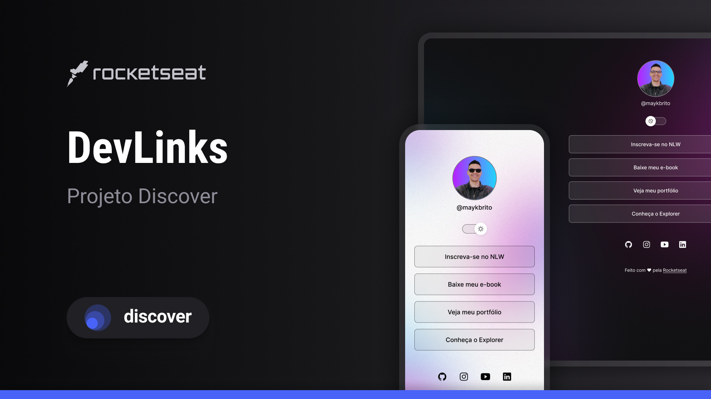

<h1 align="center">Projeto</h1>

Este é um projeto de exemplo para demonstrar o uso de tecnologias web modernas.

  <a href="#"-tecnologias">Tecnologias</a>&nbsp;&nbsp;&nbsp;|&nbsp;&nbsp;&nbsp;
  <a href="#"-projeto">Projeto</a>&nbsp;&nbsp;&nbsp;|&nbsp;&nbsp;&nbsp;
   <a href="#"-layout">Layout</a>&nbsp;&nbsp;&nbsp;|&nbsp;&nbsp;&nbsp;
  <a href="#memo-licença">Licença</a>

  

 

  

## Tecnologias

Esse projeto foi desenvolvido utilizando as seguintes tecnologias:

- HTML e CSS
- JavaScript
- Git e GitHub
- Figma

## Projeto

O projeto consiste em uma página web simples que apresenta um perfil de usuário, links para redes sociais e um modo claro/escuro. O layout é responsivo e adaptável a diferentes tamanhos de tela.

## Layout

Você pode acessar o layout do projeto no Figma através do seguinte link: [Layout no Figma](https://www.figma.com/file/Exemplo/Layout-Projeto?node-id=0-1&t=Exemplo).

## :memo: Licença

Esse projeto está sob a licença MIT.

---

Feito com :heart: by Rocketseat :wave: [Participe da nossa comunidade!] (https://discord.gg/rocketseat)
